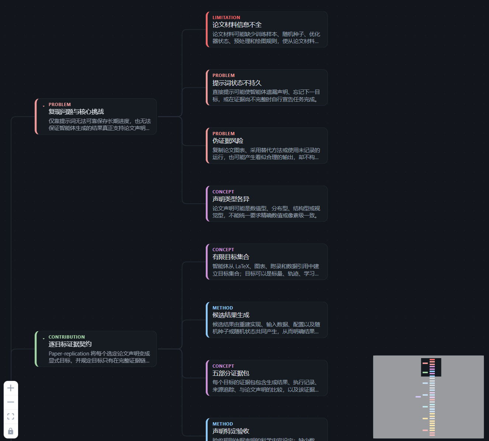
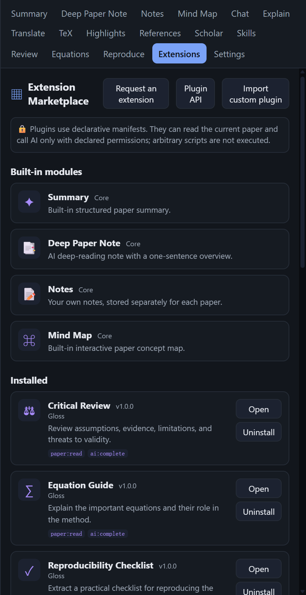

<p align="center">
  
</p>

<h1 align="center">Gloss · 旁注</h1>

<p align="center"><b>A light that annotates your papers · a local, self-hosted AI paper-reading companion</b></p>

<p align="center">
  
</p>

<p align="center"><sub><i>A beam of light illuminating a page — like a gloss written in the margins.</i></sub></p>

<p align="center"><a href="./README.zh.md"><b>中文文档 →</b></a> · <a href="./CHANGELOG.md"><b>Changelog</b></a></p>

<p align="center">
  <a href="https://www.npmjs.com/package/gloss-local"></a>
  <a href="https://github.com/computersniper/gloss/releases/latest"></a>
  <a href="https://github.com/computersniper/gloss/actions/workflows/ci.yml"></a>
</p>

<p align="center"><a href="https://computersniper.github.io/gloss-site/"><b>🌐 Visit the Gloss website</b></a></p>

---

Gloss (旁注) is a **self-hosted, locally-run** research-paper reader. A FastAPI backend serves a
React / PDF.js reader UI and drives an LLM to help you skim, study, translate, and ask questions
about a paper.

The model **defaults to your local `claude` CLI**. It also supports the local `codex` CLI, the Anthropic API,
and **any OpenAI-compatible endpoint** (local vLLM, a claude proxy, etc.). It can even **load and run
Claude / Codex skills** directly against the paper you're reading.

Everything runs on your own machine. Use Gloss as a native Windows app or open the web version in your browser.

---

## 👀 See Gloss in action

Read a paper, inspect the AI's structure, and keep a local library in the same
workspace. For the interactive product tour, visit the
[Gloss website](https://computersniper.github.io/gloss-site/).

<table>
  <tr>
    <td width="50%" valign="top">
      
    </td>
    <td width="25%" valign="top">
      
    </td>
    <td width="25%" valign="top">
      
    </td>
  </tr>
  <tr>
    <td valign="top"><b>Reader demo</b><br />A real PDF text layer stays beside a structured AI brief, with room for notes, chat, and annotations.</td>
    <td valign="top"><b>Interactive mind maps</b><br />Explore paper concepts and their connections without leaving the reader.</td>
    <td valign="top"><b>Extension Marketplace</b><br />Install, open, or remove reading modules for your workflow.</td>
  </tr>
</table>

<p align="center"><sub>Desktop application screenshots. The browser version uses the same local workspace.</sub></p>

---

## ✨ Features

| Feature | What it does |
|---|---|
| 📖 **PDF reader** | PDF.js with a real selectable text layer; select text to pop up actions (Explain / Translate / add-to-chat / highlight) |
| 🧠 **Summary** | One-click TL;DR + problem / method / results / contributions / limitations |
| 📝 **Notes** | Structured study notes, **copy** or **download `.md`** |
| 🗺️ **Mind Map** | Interactive React Flow map: zoom, expand/collapse, click a node for its summary and connections |
| 💬 **Chat** | Ask like a colleague — **BM25 retrieval (RAG)** over the whole paper, **persistent Codex sessions**, editable auto-titles, streaming, and multiple saved chats per paper |
| 💡 **Explain** | Select an equation / term / table and get a one-shot explanation; math rendered with **KaTeX** |
| 🌐 **Translate** | **Sentence-level**, **persistently cached**, **reused across page ranges**; translation-only by default with a show-original toggle; **click a sentence to flash-locate it in the PDF**; for arXiv, **translate the exact LaTeX source** so nothing is missed |
| 📐 **arXiv LaTeX** | A **TeX tab** to read the paper's LaTeX source (exact, no extraction loss) — and translate from it |
| 🖍️ **Auto-highlight** | The AI picks key sentences by category and **anchors colored highlights onto the PDF** |
| ✍️ **Annotations** | Personal notes, multi-color highlights, pencil, pen, highlighter and eraser, all saved locally on the page |
| 📎 **Lasso to chat** | Freehand-circle any PDF region, preview the screenshot, then attach it directly to Chat |
| 🔗 **References** | Parses the bibliography, enriches via **Crossref / arXiv**, **each entry is clickable** |
| 🔭 **Scholar** | Find related papers via **Semantic Scholar / arXiv** and **import** them in one click |
| 📚 **Library** | Import by **arXiv id / DOI / URL / PDF upload**, managed in one place |
| 🧩 **Skills** | Discover and run **Claude / Codex skills** against the current paper |
| 🔌 **Plugins** | Install or uninstall extensible reader panels from the built-in marketplace |
| ➕ **Add to chat** | Select content in the PDF or any panel → send it into Chat and get an answer about it |
| 🎨 **Themes & reading modes** | **7 color themes**, plus PDF reading modes — **Normal / Sepia (护眼) / Night (夜间)** |
| 🗣️ **Languages** | **Interface language** (English / 中文, default English), plus the AI's **answer language** and **translation target language** |
| ⚙️ **Quality** | Long operations keep running across tab switches; panels stay mounted so **scroll position and mind-map viewport are preserved**; **Test-connection** button for each provider |

---

## 🚀 Install & run

### Let Claude Code or Codex install it

Paste this into Claude Code or Codex:

```text
Install and run https://github.com/computersniper/gloss on this computer. Use the easiest supported method for this OS, preserve existing Gloss data, and verify /api/health before giving me the local URL.
```

Gloss is available as a Windows desktop app and as a browser-based web app. Both keep the backend, papers, and generated results on your own machine.

### Windows desktop app

Download the `.exe` matching your Windows processor, then double-click it.
Gloss opens in its own desktop window, without a terminal or browser tab, and
automatically selects a free local port.

### Choose a release download

Every tagged release includes a portable desktop package for each supported
platform. Pick the one matching your computer from the
[latest release](https://github.com/computersniper/gloss/releases/latest):

| Platform | Direct download |
| --- | --- |
| Windows x64 (Intel / AMD) | [Gloss-windows-x64.exe](https://github.com/computersniper/gloss/releases/latest/download/Gloss-windows-x64.exe) |
| Windows ARM64 | Use [Gloss-windows-x64.exe](https://github.com/computersniper/gloss/releases/latest/download/Gloss-windows-x64.exe) through Windows x64 emulation (no native ARM64 binary yet) |
| Windows x86 (32-bit) | Not supported; install 64-bit Windows |
| Linux / macOS | Use [npm or Bun](#web-app--windows--linux-with-npm-or-bun) for the local browser app |
| Legacy x64 link | [Gloss.exe](https://github.com/computersniper/gloss/releases/latest/download/Gloss.exe) |

The Windows downloads are standalone `.exe` files—there is nothing to unpack.
See [release download notes](docs/releases.md) for platform-specific details.

### Web app — Windows / Linux with npm or Bun

Requires Node.js 18+ and Python 3.11+:

```bash
node --version
python --version
npm --version          # or: bun --version

npx gloss-local@latest
# or
bunx gloss-local@latest
```

Then open the local URL shown in the terminal (normally `http://localhost:8010`) in your browser.

The first run installs the backend into an isolated environment; later runs reuse it. For a permanent
command, run `npm install --global gloss-local` or `bun add --global gloss-local`, then start Gloss with
`gloss`. Debian / Ubuntu may also need `sudo apt install python3-venv`.

### From source (developers)

Requires Git, Node.js 20.19+, and Python 3.11+:

```bash
git clone https://github.com/computersniper/gloss.git
cd gloss
npm run setup
npm start
# or: bun run setup && bun run start
```

#### Native scripts (optional)

```bash
# Linux
scripts/setup.sh
scripts/run.sh

# Windows PowerShell
.\scripts\setup.ps1
.\scripts\run.ps1
```

Open `http://localhost:8010`. Use `--port` and `--host` to change the address, for example:
`npx gloss-local@latest --port 6006 --host 127.0.0.1`.

### Remote Linux over SSH

Start Gloss on the server, then create a tunnel from your local computer:

```bash
# Remote server
npx gloss-local@latest --host 127.0.0.1 --port 8010

# Local computer
ssh -N -L 8010:127.0.0.1:8010 -p <ssh-port> user@server
```

Open `http://localhost:8010` locally.

Persistent data is stored in `%LOCALAPPDATA%\Gloss\data` on Windows and
`$XDG_DATA_HOME/gloss` (default `~/.local/share/gloss`) on Linux. Set `GLOSS_DATA_DIR` to override it.

---

## 🧰 CLI

```bash
./gloss serve                  # Linux/macOS: start the web app
.\gloss.ps1 serve              # Windows PowerShell
./gloss open <pdf|arxiv|doi>   # import + serve + open the browser
./gloss import <src>           # add a local PDF / arXiv / DOI to the library
./gloss ls                     # list the library
./gloss summarize <id|pdf|arxiv>   # print a summary in the terminal
./gloss chat <id>              # interactive terminal chat
./gloss skills                 # list discovered Claude / Codex skills
```

For example: `./gloss open 1706.03762` opens *Attention Is All You Need* and launches the reader.

---

## 🤖 AI providers & advanced settings

Pick a provider in **Settings** (the generated `config.json` is stored in the data directory):

| Provider | Notes | Key? |
|---|---|---|
| `local_claude` | **Default.** Calls the local `claude` CLI via your subscription | ❌ no key |
| `local_codex` | Calls the local `codex` CLI via your ChatGPT subscription | ❌ no key |
| `anthropic` | Anthropic API, or any Anthropic-compatible endpoint | ✅ `base_url` + `api_key` |
| `openai` | Official OpenAI **or any OpenAI-compatible endpoint** | ✅ `base_url` + `api_key` |

The `openai` entry can point at a **local vLLM** or **claude proxy** (e.g. `http://127.0.0.1:8899/v1`) for a fully-offline setup.

**Advanced (per provider):** model (e.g. `sonnet` / `opus`, a full model id, or blank for the CLI's default) and
**reasoning effort** (`local_claude`: `low … max`; `local_codex`: `minimal … high`). **Answer language** and
**translation target language** are also configurable (both default to Simplified Chinese). Keys are masked by the
Settings API and runtime data directories are outside version control, so secrets never enter the repository.

---

## 🏗️ Architecture

```
backend/          FastAPI (one process mounts every /api/*, and serves the built frontend SPA)
  app/providers/  local_claude · local_codex · anthropic · openai · registry (LLM abstraction)
  app/pdf/        PyMuPDF parsing (text blocks + bboxes) + structure heuristics (sections/refs/sentences)
  app/features/   summarize · explain · translate · chat(RAG) · highlight · notes · mindmap · citations
  app/search/     Scholar search / recommend (Semantic Scholar / arXiv)
  app/skills/     discover & run Claude/Codex SKILL.md skills
  app/library/    SQLite store + importers (arXiv/DOI/PDF)
  app/routers/    papers · ai · citations · scholar · annotations · skills · settings
frontend/         React + Vite + pdfjs-dist + KaTeX + React Flow (built to frontend/dist, served by the backend)
cli/ gloss.py     scripts/ gloss.mjs · setup/run/dev (.sh + .ps1)
```

**Data** lives in the platform data directory described above: a SQLite DB plus
one folder per paper with its `original.pdf` and parsed `parsed.json`.

---

## 💡 Notes

- **Local `claude` / `codex` run standalone** — they sign in with your existing subscription (no API key),
  and each answer is scoped to the current paper only, never mixed with your personal Claude/Codex config.
- **Your data stays local** — papers, highlights, notes, and chats are stored in a local SQLite database plus
  per-paper files in the platform data directory; nothing leaves your machine except the external lookups below.
- **External lookups degrade gracefully** — References / Scholar go through the machine's HTTP proxy; if a
  source is offline, Gloss falls back to local data instead of erroring the whole page.
- **Generated results are cached** — summary / notes / mind map / translation / highlights are saved after the
  first generation and reused on re-entry, so you don't re-spend compute or quota.

---

## 🙏 Acknowledgments

Gloss is a **local, self-hosted reconstruction of [Moonlight](https://www.themoonlight.io/)** ("an AI colleague
for reading research papers") — rebuilt from scratch to run entirely on your own machine. Its design also draws
inspiration from two lovely projects:

- **[Understand-Anything](https://github.com/Egonex-AI/Understand-Anything)** — for the interactive node-link
  **mind map** (React Flow, click-to-focus, collapsible nodes).
- **[DeepPaperNote](https://github.com/917Dhj/DeepPaperNote)** — for the structured, generated **study notes**.

Huge thanks to the authors of all three. 🙏
