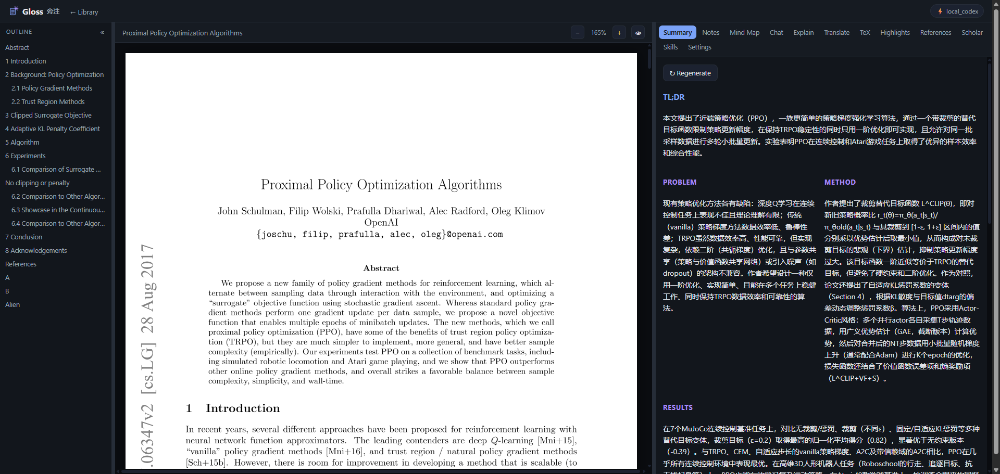

<p align="center">
  
</p>

<h1 align="center">Gloss · 旁注</h1>

<p align="center"><b>照亮论文的批注 · 本地自托管的 AI 论文阅读助手</b></p>

<p align="center">
  
</p>

<p align="center"><sub><i>一束光，照亮一页论文 —— 就像在字里行间写下的旁注。</i></sub></p>

<p align="center"><a href="./README.md"><b>English →</b></a> · <a href="./CHANGELOG.md"><b>版本记录</b></a></p>

---

Gloss（旁注）是一个 **自托管、本地运行** 的科研论文阅读工具。它用一个 FastAPI 后端提供基于
React / PDF.js 的阅读器界面，并驱动一个大模型帮你速览、研读、翻译、答疑。

大模型 **默认使用你本机的 `claude` CLI**，
此外还支持本机的 `codex` CLI、Anthropic API，以及 **任意 OpenAI 兼容端点**（本地 vLLM、claude 代理等）。
它还能 **加载并运行 Claude / Codex 技能（skills）**，直接作用在你正在读的这篇论文上。

一切都跑在你自己的机器上：一个进程、一个端口，打开浏览器就能读。

---

## 👀 预览

<p align="center">
  
</p>

---

## ✨ 功能一览

| 功能 | 说明 |
|---|---|
| 📖 **PDF 阅读器** | 基于 PDF.js，带真正可选中的文本层；选中文字即弹出操作（Explain / Translate / 加入会话 / 高亮） |
| 🧠 **速览 Summary** | 一键生成 TL;DR + 问题 / 方法 / 结果 / 创新点 / 局限 |
| 📝 **研读笔记 Notes** | 结构化精读笔记，可 **一键复制** 或 **下载 `.md`** |
| 🗺️ **思维导图 Mind Map** | 交互式 React Flow 导图：缩放、展开 / 折叠、点击节点看该节点的摘要与相互连接 |
| 💬 **对话 Chat** | 像同事一样提问 —— 基于全篇 **BM25 检索（RAG）** 作答、**流式输出**、**每篇论文保留多个会话**、可删除、随时新建 |
| 💡 **解释 Explain** | 选中一段公式 / 术语 / 表格，一次性解释清楚；数学用 **KaTeX** 渲染 |
| 🌐 **翻译 Translate** | **逐句翻译**、结果 **持久缓存**、**跨页范围复用**；默认只显示中文，可切换 **显示原文**；**点击译文可在 PDF 中闪烁定位**；arXiv 论文可 **直接翻译 LaTeX 源**，不漏文本 |
| 📐 **arXiv LaTeX** | **TeX 源码标签**：读取论文 LaTeX 源（精确、无提取损失），并可从源翻译 |
| 🖍️ **自动高亮 Auto-highlight** | AI 按类别挑出关键句，并 **锚定到 PDF 原文位置** 标色 |
| ✍️ **批注 Highlights** | 你自己的高亮（多种颜色）+ 笔记，锚定在页面上并保存 |
| 🔗 **参考文献 References** | 解析文末参考文献，经 **Crossref / arXiv** 补全，**每条可点击跳转** |
| 🔭 **学术搜索 Scholar** | 通过 **Semantic Scholar / arXiv** 找相关论文，一键 **导入** |
| 📚 **论文库 Library** | 通过 **arXiv id / DOI / URL / 上传 PDF** 导入，集中管理 |
| 🧩 **技能 Skills** | 发现并运行 **Claude / Codex 技能**，作用于当前论文 |
| ➕ **加入会话** | 在 PDF 或各面板里选中内容 → 一键送入 Chat，让 AI 就这段内容回答 |
| 🎨 **主题与阅读模式** | 内置 **7 套配色**，另有 PDF 阅读模式 —— **正常 / 护眼 / 夜间** |
| 🗣️ **多语言** | **界面语言**（English / 中文，默认英文），以及 AI **回答语言** 与 **翻译目标语言** |
| ⚙️ **体验** | 长任务切换标签也不中断；侧栏常驻，**滚动位置与思维导图视图都会保留**；每个提供方可 **测试连通性** |

---

## 🚀 安装与运行（Windows / Linux）

### Windows：下载即用

从 [GitHub 最新版本](https://github.com/computersniper/gloss/releases/latest) 下载
**`Gloss.exe`**，双击即可运行。这个便携版已经包含 Gloss 前端、Python 运行时和后端依赖，
不要求安装 Git、Node.js、Python，也不需要 clone 源码。

Gloss 可以直接使用这台电脑上已登录的 Claude Code 或 Codex CLI 订阅。在设置里选择
**Local Claude** 或 **Local Codex** 即可，不需要填写 API Key，也不会产生额外的 API 账单；
对应的 CLI 仍需事先安装并在本机完成登录。

### Windows / Linux：npm 一条命令

如果电脑上已经有 Node.js 18+ 和 Python 3.11+，直接运行：

```bash
npx gloss-local@latest
```

Debian / Ubuntu 如果尚未提供 venv，需要先安装一次系统组件：
`sudo apt install python3-venv`（也可能是 `python3.12-venv` 这样的版本包）。

无需 clone。首次运行会在系统规范的 Gloss 缓存目录中创建隔离的 Python 环境、安装后端依赖，
随后自动启动；以后会复用这个环境。也可以运行 `npm install --global gloss-local` 永久安装，
之后在任意目录执行 `gloss`。

### 交给 Claude Code 或 Codex 安装源码版 😄

在终端中打开 Claude Code 或 Codex，把下面这段提示词直接交给它：

```text
请在这台电脑上安装并运行 https://github.com/computersniper/gloss。
先识别系统是 Windows 还是 Linux，并使用适合当前系统的命令。如果仓库尚未存在，
请先 clone；如果当前已经在仓库中，请直接使用当前工作区，不要覆盖本地修改。
检查 Node.js 20.19+ 和 Python 3.11+；如缺少系统级依赖，先询问我再安装。
默认使用 npm（也支持 Bun），执行项目的 setup 命令并启动 Gloss，确认
GET /api/health 返回 HTTP 200，最后告诉我本地访问地址。保留已有的 Gloss 数据和配置。
```

源码安装和启动命令可以都交给它执行；为了方便检查和排错，下面仍给出完整步骤。

### 从源码安装（开发者）

#### 1. 准备环境并获取源码

先安装 Git、Node.js 20.19+ 和 Python 3.11+，然后克隆仓库：

```bash
git clone https://github.com/computersniper/gloss.git
cd gloss
node --version
python --version
```

Windows 也可以用 `py --version`。如果 Python 位于自定义路径，可设置
`GLOSS_PYTHON`，或给 setup 命令传入 `--python <路径>`。
Debian / Ubuntu 若无法运行 `python -m venv`，还需要安装 `python3-venv`。

#### 2. 安装依赖并启动

PowerShell、命令提示符和 Bash 都可以使用同一套 npm 命令：

```bash
npm run setup        # 首次：创建后端 venv、安装依赖、构建前端
npm start            # 在 :8010 启动应用
npm run dev          # 可选：后端和前端热重载
```

也可以使用 Bun：

```bash
bun run setup
bun run start
bun run dev           # 可选：热重载
```

#### 3. 系统原生脚本（可选）

项目也提供系统原生包装脚本：

```bash
# Linux
scripts/setup.sh
scripts/run.sh

# Windows PowerShell
.\scripts\setup.ps1
.\scripts\run.ps1
```

#### 4. 验证并打开

浏览器打开 **`http://localhost:8010`**（也可以运行
`curl http://localhost:8010/api/health`），粘贴一个 arXiv id（例如 `1706.03762`）
或上传 PDF，点开卡片就能读。

端口 / 监听地址可用环境变量覆盖：

```bash
GLOSS_PORT=6006 GLOSS_HOST=0.0.0.0 scripts/run.sh
```

- `GLOSS_PORT` —— 服务端口（默认 `8010`）
- `GLOSS_HOST` —— 监听地址（默认 `0.0.0.0`）
- `GLOSS_DATA_DIR` —— 覆盖数据目录
- `GLOSS_CACHE_DIR` —— 覆盖依赖和下载缓存目录
- `GLOSS_IMPORT_TIMEOUT` —— 下载论文的等待秒数（默认/上限 `300`）
- `GLOSS_IMPORT_PARSE_TIMEOUT` —— 解析 PDF 的等待秒数（默认/上限 `120`）
- `GLOSS_LEGACY_ENCODING` —— 数据跨 Windows 区域设置迁移后，用指定编码读取
  旧版非 UTF-8 配置和论文元数据（例如 `cp936` 或 `cp1252`）

默认会把持久数据放到操作系统规范的应用数据目录：

- Windows：`%LOCALAPPDATA%\Gloss\data`
- Linux：`$XDG_DATA_HOME/gloss`，未设置时为 `~/.local/share/gloss`

缓存默认位于 Windows 的 `%LOCALAPPDATA%\Gloss\cache`，或 Linux 的
`$XDG_CACHE_HOME/gloss`（未设置时为 `~/.cache/gloss`）。若升级前已有非空的
`backend/data`，为避免丢失旧数据，程序会继续使用它。

服务监听在 `0.0.0.0`，从别的电脑访问可用服务商的端口映射或 SSH 转发
（如 `ssh -CNg -L <端口>:127.0.0.1:<端口> -p <SSH端口> user@host`，然后打开 `http://localhost:<端口>`）。

> 也可以直接传参数，例如 `npm start -- --port 6006 --host 127.0.0.1`。

---

## 🧰 CLI

```bash
./gloss serve                  # Linux/macOS：启动 web 应用
.\gloss.ps1 serve              # Windows PowerShell
./gloss open <pdf|arxiv|doi>   # 导入 + 启动服务 + 打开浏览器
./gloss import <src>           # 把本地 PDF / arXiv / DOI 加入论文库
./gloss ls                     # 列出论文库
./gloss summarize <id|pdf|arxiv>   # 在终端打印一份速览
./gloss chat <id>              # 终端里的交互式对话
./gloss skills                 # 列出发现到的 Claude / Codex 技能
```

例如：`./gloss open 1706.03762` 打开《Attention Is All You Need》并启动阅读器。

---

## 🤖 AI 提供方与进阶设置

在 **Settings** 里选择 provider（生成的 `config.json` 位于数据目录中）：

| Provider | 说明 | 需要 key？ |
|---|---|---|
| `local_claude` | **默认**。调用本机 `claude` CLI，走订阅登录 | ❌ 免 key |
| `local_codex` | 调用本机 `codex` CLI，走 ChatGPT 订阅 | ❌ 免 key |
| `anthropic` | Anthropic API，或任意 Anthropic 兼容端点 | ✅ 填 `base_url` + `api_key` |
| `openai` | 官方 OpenAI **或任意 OpenAI 兼容端点** | ✅ 填 `base_url` + `api_key` |

`openai` 可指向 **本地 vLLM** 或本地 **claude 代理**（如 `http://127.0.0.1:8899/v1`），完全离线用自己的模型。

**进阶设置**（每个 provider 可单独配）：模型（如 `sonnet` / `opus`、完整 model id，或留空用 CLI 默认）与
**思考深度 / reasoning effort**（`local_claude`：`low … max`；`local_codex`：`minimal … high`）。**回答语言** 与
**翻译目标语言** 也都可配（默认均为中文）。key 会被 Settings API 掩码，运行时数据目录不进入版本库。

---

## 🏗️ 架构简述

```
backend/          FastAPI（一个进程挂载所有 /api/*，并托管已构建的前端 SPA）
  app/providers/  local_claude · local_codex · anthropic · openai · registry（LLM 抽象层）
  app/pdf/        PyMuPDF 解析（文本块 + bbox）+ 结构启发式（章节/引用/分句）
  app/features/   summarize · explain · translate · chat(RAG) · highlight · notes · mindmap · citations
  app/search/     scholar 检索 / 推荐（Semantic Scholar / arXiv）
  app/skills/     发现并运行 Claude/Codex 的 SKILL.md 技能
  app/library/    SQLite 库 + 导入器（arXiv/DOI/PDF）
  app/routers/    papers · ai · citations · scholar · annotations · skills · settings
frontend/         React + Vite + pdfjs-dist + KaTeX + React Flow（build 到 frontend/dist，由后端托管）
cli/ gloss.py     scripts/ gloss.mjs · setup/run/dev（.sh + .ps1）
```

**数据** 位于上文所述的系统数据目录：一个 SQLite 库，加上每篇论文的目录，
其中包含 `original.pdf` 与解析后的 `parsed.json`。

---

## 💡 小贴士

- **本地 `claude` / `codex` 独立运行**：走你已有的订阅登录（无需 API key），每次回答只针对当前论文，
  不会和你个人的 Claude / Codex 配置混在一起。
- **数据都在本地**：论文、批注、笔记、对话都存在系统数据目录中的 SQLite 库与每篇论文的文件里；
  除下面的外部检索外，数据不出你的机器。
- **外部检索优雅降级**：References、Scholar 等外网请求统一走机器的 HTTP 代理；某个站点连不上（离线）时会
  **优雅降级** 到本地已解析数据，不会整页报错。
- **生成结果持久缓存**：总结 / 笔记 / 导图 / 翻译 / 高亮 首次生成后落盘保存，重进论文直接复用，不重复消耗算力与额度。

---

## 🙏 致谢

Gloss 是对 **[Moonlight](https://www.themoonlight.io/)**（"陪你读论文的 AI 同事"）的一次 **本地自托管重构** ——
从零重写，让它完全跑在你自己的机器上。设计上还参考了两个很棒的项目：

- **[Understand-Anything](https://github.com/Egonex-AI/Understand-Anything)** —— 交互式节点连线 **思维导图**
  （React Flow、点击聚焦、可折叠节点）的灵感来源。
- **[DeepPaperNote](https://github.com/917Dhj/DeepPaperNote)** —— 结构化 **研读笔记** 的灵感来源。

衷心感谢以上三个项目的作者。🙏
